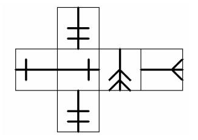
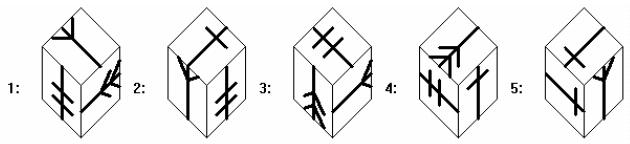
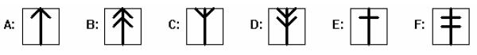
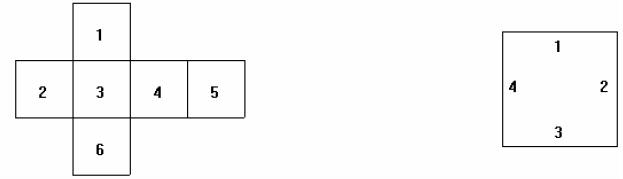
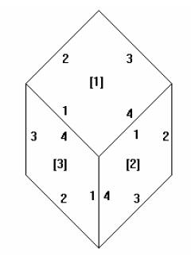

# Spatial Concepts Test

문제 ID: `SPETIAL`

## 문제

#### 문제

The Flathead Testing Corporation (FTC) supplies various tests for Human Resources departments at many companies. One type of test they supply includes spatial concepts questions such as:

When the following figure is folded back on the interior lines it forms a cube.

Which of the following could be an image of one corner of the resulting cube?

among the choices and another (given in the example) had two solutions among the choices (1 and 3).

FTC needs a routine which will read in a specification of the unfolded cube and specifications of corner views and determine, for each corner view, whether it is a view of a corner of the cube specified in the unfolded part.

FTC uses the following images as faces of each cube. Each image is symmetrical about the vertical axis and has a distinguished end (up in each image).

The unfolded cube is specified by a string of six pairs of a letter indicating the image on the face and a number indicating the orientation of the distinguished end of the face: 1 is up, 2 is right, 3 is down and 4 is left. The faces are specified in the order given in the following figure with the orientations indicated in the square to the right:

So the unfolded cube in the example is specified as “F3E4E2D3C2F3”. FTC has a routine which  
reads this specification and generates the unfolded image for the question.

The answer images are specified by three pairs of a letter and a digit indicating a face image and an orientation as indicated in the following diagram. The faces are specified in the order top, right, left (indicated by numbers in brackets in the figures), that is clockwise around the center vertex starting at the top. The orientation of the distinguished end of each face is indicated by the numbers on the edges in the diagram. They circle each face clockwise, starting at the center vertex.

For the example, the answer figures are specified as “C2D2F2”, “E3F3C4”, “F2C2D2”, “D1E1F3” and “E1C1E1”. Again, FTC has a routine which reads this specification and generates each answer image for the question. They just need your routine to make sure there is exactly one correct answer to each question.

## 입력

#### 입력

The first line of input contains a single integer N, (1 ≤ N ≤ 1000) which is the number of datasets that follow.  
Each dataset consists of six lines of input. The first line of input is the specification for the folded out cube as described above. This line is followed by five lines, each of which gives the specification of one answer image as described above.

## 출력

#### 출력

For each dataset, output on a single line the dataset number, (1 through N), a blank, the number of answers which are solutions of the problem (corners of the cube specified in the folded out line), a blank and five ‘Y’ or ‘N’ characters separated by a blank indicating which of the answer images was a solution (‘Y’ for a solution, ‘N’ for not a solution).

## 노트

#### 노트
