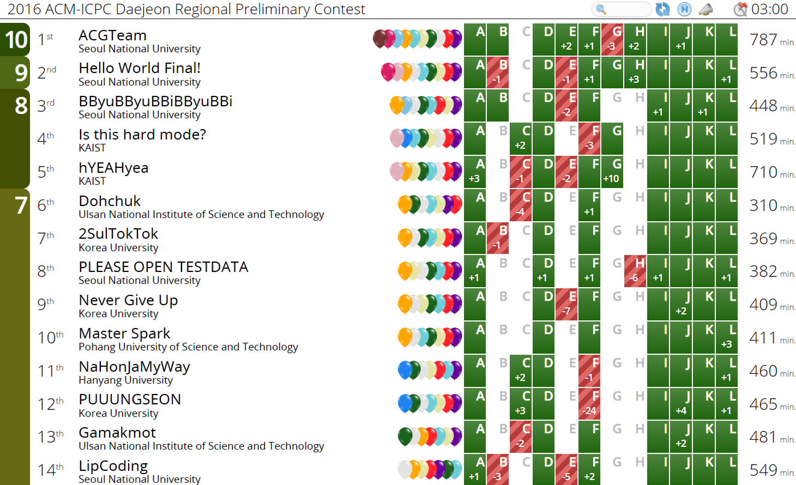

# Spotboard

문제 ID: `SPOTBOARD`

## 문제

#### 문제

알고스팟의 뛰어난 운영진 분들은 알고리즘 대회에서 스코어보드로 쓸 수 있는 Spotboard를 개발하였다. 예쁜 UI와 더불어 시상식을 할 때 각 팀들의 제출 결과를 보여주며 등수가 올라가는 장면은 아주 인상적이다. 다음은 Spotboard 일부의 스크린 샷이다.

  
그림 1. Spotboard, 2016 ICPC 한국 예선 대회 결과, Spotboard Project from algospot.com, Being and wookayin

알고리즘 대회는 각 대회마다 규칙이 미세하게 다를 수 있지만, 이 문제에서는 다음의 규칙을 가정한다.

1. 많은 문제를 푼 팀이 등수가 더 높다.
2. 푼 문제의 수가 같다면, total time이 작은 팀이 더 등수가 높다. Total time은 해당 팀이 푼 모든 문제에 대해, 대회 시작부터 각 문제를 풀기까지 걸린 시간의 합이다. 만약 문제를 성공적으로 풀기 전 잘못된 답안을 제출했었다면, 한 번당 20의 페널티가 total time에 추가된다. 결국 풀지 못한 문제에 주어진 페널티는 total time에 반영되지 않는다. 예를 들어, 어느 팀이 1번 문제를 대회 시작 후 10분이 지난 후 맞췄는데 2번째 제출이었을 경우 20 + 10 = 30 의 시간이 total time에 더해진다. 2번 문제를 여러 번의 제출 후에도 대회 종료까지 풀지 못했다면 이 문제에 대해선 0이 더해진다.
3. Total time이 같은 경우 마지막으로 푼 문제를 먼저 푼 팀이 등수가 높다.
4. 이상의 조건에서 등수가 판별이 되지 않을 경우 공동 등수가 된다. 공동 등수는 이후 팀의 등수에 영향을 미치지 않는다. 예를 들어, 2팀이 공동 1등일 경우 다음 팀은 2
   등이 아니라 3등이 된다.

대회 중 특정 시간 이후에는 스코어보드가 Freeze되어 그 이후에 제출된 모든 답안의 결과는 스코어보드에 반영되지 않으며, 따라서 끝까지 누가 1등을 했는지 알 수 없는 것이 대회의 큰 묘미이다. 시상식에서 Freeze 이후 결과는 다음과 같은 방식으로 보여주게 된다.

1. Freeze된 시점에서의 스코어보드 상태에서 시작한다. 스코어보드는 위 규칙을 따라 계산된 등수의 오름차순으로 팀들을 정렬하며, 등수가 같을 경우 팀 번호의 오름차순으로 정렬한다.
2. 스코어보드에서 가장 아래에 있는 팀을 선택한다. 1번 문제부터 차례대로 순회하며, 이 팀의 미공개 답안 결과를 하나씩 발표한다. 이 때 정답이 나올 경우, 이 정답을 반영해 등수가 재계산되고, 위 규칙에 따라 스코어보드가 재정렬된다.
3. 한 팀이 정답을 제출한 이후에도 계속 해당 문제에 대해 답안을 제출했을 경우, 정답 이 후의 답안들은 무시된다.
4. 가장 아래 있는 팀의 모든 제출 결과가 공개되고 나면, 그 위 팀으로 올라가 위 과정을 반복한다.

대회 운영을 하고 있던 태현이는 시상식에 일어나는 이벤트를 미리 시뮬레이션 해보고 싶다. 태현이를 도와 시상식에서 정답 제출이 나올 때마다 등수가 어떻게 변화하는지 계산해보자.

## 입력

#### 입력

첫 번째 줄에 팀 수를 나타내는 수 $N$과 전체 문제 수 $M$, 전체 제출의 수 $K$, Freeze가 된 시간 $F$가 주어진다. (제출된 시간 $t$가 $F$ 이상일 경우 해당 답안의 결과는 시상식 전까지 공개되지 않습니다.) ($1 \le N \le 500$, $1 \le M \le 20$, $1 \le K \le 20\,000$, $0 \le F \le 1\,000$)

두 번째 줄부터 K개의 줄에 걸쳐 각 줄에 하나씩 답안의 정보들이 제출 순서대로 주어진다. 각 답안의 정보는 "$T$ $t$ $p$ $r$" 형태의 공백으로 구분된 네 정수로 이루어져 있으며, $T$는 제출 시간, $t$는 팀 번호, $p$는 문제 번호를 나타낸다. $r$은 $0$ 혹은 $1$이며, $0$은 해당 답안이 오답, $1$은 정답인 경우를 각각 나타낸다. ($0 \le T \le 1\,000$, $1 \le t \le N$, $1 \le p \le M$)

## 출력

#### 출력

첫 번째 줄에 시상식 중에 공개되는 정답 답안의 개수 $X$를 출력한다.

두 번째 줄부터 $X$개의 줄에 걸쳐 한 줄에 하나씩, 공개되는 순서대로 정답의 정보를 세 개의 정수를 공백으로 구분하여 "$A$ $B$ $C$" 형태로로 출력한다. 이 때, $A$는 팀 번호, $B$는 해당 정답이 공개되기 전에 팀의 등수, $C$는 해당 정답이 공개된 후 해당 팀의 등수를 나타낸다.

## 노트

#### 노트

예제 입출력에서 Example로 시작하는 줄은 실제 입출력에 포함되지 않습니다. 각각을 하나의 입출력 세트로 읽어주세요.
