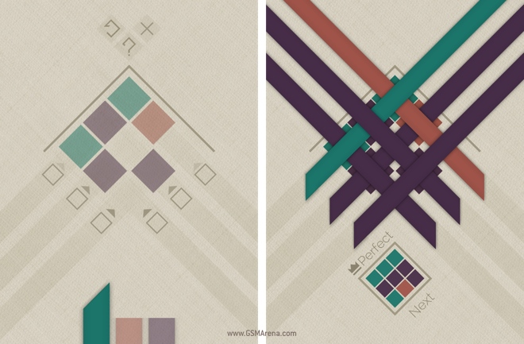

# Strata

문제 ID: `STRATA`

## 문제

#### 문제

Strata는 2013년에 꽤 흥했던 모바일 게임이다.

Strata는 특정 크기의 정사각형 격자판이 주어지는 것으로 시작한다. 그림의 왼쪽에서 볼 수 있듯 각 격자판에 색이 주어지는 경우가 있고, 그렇지 않은 경우가 있다. 편의상 시계 방향으로 45도 돌린 판을 생각하도록 하자.

게임의 목표는 각 색깔의 끈을 순서대로 각 행 혹은 각 열에 놓은 다음, 최종적으로 위에서 본 색상이 격자판과 동일하게 만드는 것이다. 이 때, 각 색깔의 끈은 여러번 사용할 수 있고, 투명한 칸에는 임의의 색상이 위치해도 된다.

그림의 오른쪽은 해당 격자판을 해결한 결과를 보여주고 있다. 순서대로 두 번째 행에 보라색 끈, 세 번째 열에 갈색 끈, 첫 번째 열에 보라색 끈, 첫 번째 행에 청록색 끈, 두 번째 열에 보라색 끈, 세 번째 행에 보라색 끈을 놓으면 주어진 격자판에 맞는 결과를 낼 수 있다.

평소 컴퓨터의 능력에 대한 의심이 많은 대근이는 ‘이 게임을 컴퓨터로 해결할 수 있을까’라는 의문에 빠졌다. 물론 대근이의 두뇌가 더 뛰어나긴 하지만, 컴퓨터도 이 게임을 해결할 수 있다는 것을 보여주자!

## 입력

#### 입력

첫 줄에 테스트 케이스의 수 $T$($1 \le T \le 100$)가 주어진다.

각 테스트 케이스의 첫 번째 줄에 격자의 크기 $N$($1 \le N \le 4$), 색상의 종류 $C$($1 \le C \le 5$)가 공백으로 분리되어 주어진다. 그 다음 줄부터 $N$개의 줄에 걸쳐 각 격자칸의 정보 $S\_{ij}$가 공백으로 분리되어 주어진다. $S\_{ij}$는 $0$이상 $C$이하의 정수로 $0$인 경우 해당 칸이 투명한 것을 의미하고, 그 이외의 경우 해당 색상이 칠해져 있음을 의미한다.

## 출력

#### 출력

출력은 각 테스트 케이스에 대해 $2N$개의 줄로 이루어진다. 각 줄은 $3$개의 정수 $b$, $l$, $c$를 공백으로 분리하여 출력하도록 한다. $b$는 행(가로 줄)인 경우 $1$, 열(세로 줄)인 경우 $2$를 출력하면 되고, $l$은 해당 행 혹은 열에서 몇 번째인지를 $1$이상 $N$이하의 정수를, $c$는 어떤 색상의 끈을 놓을 것인지 $1$이상 $C$이하의 정수를 출력하면 된다.

답이 여러가지인 경우, **사전 순으로 가장 먼저 오는 것**을 출력한다.

## 노트

#### 노트
