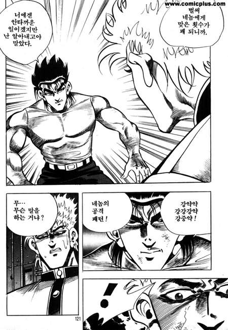

# Shuffle VS Sort

문제 ID: `SVSS`

## 문제

#### 문제

altertain은 카드를 오름차순으로 정렬하고 있는 중이다. 일렬로 늘어놓은 카드 중에서 두 장을 골라서 서로 위치를 바꾸는 작업(교환)을 통해 카드를 정렬하고 있다. 그리고 그는 가장 적은 교환을 통해 카드를 오름차순으로 정렬하고 싶어한다.

어린이는 카드 정렬을 방해하고 있는 중이다. altertain이 한 번 카드를 바꾸고 나면 어린이도 카드를 한 번 바꿔서 altertain의 정렬을 방해한다. altertain 은 어린이를 혼내는 대신, 어린이의 행동 패턴을 파악해서 어린이를 골려 주려고 한다. 어린이가 방해하는 모습을 유심히 본 altertain은 어린이가 카드의 배치 상태가 어떻든 상관 없이 일정한 패턴으로 카드를 바꾼다는 사실을 발견했다.

카드의 상태와 어린이의 행동 패턴이 주어졌을 때, 최소의 교환으로 카드를 정렬할 수 있는 방법을 찾아서 altertain을 도와주자. 단, 우리의 목적은 어린이를 골려주기 위한 것이므로 어린이가 마지막에 카드를 바꾸면 정렬이 완료되도록 한다.

## 입력

#### 입력

입력의 첫 줄에는 테스트 케이스의 개수 T가 주어진다. ( T≤60 )

각 입력의 첫 줄에는 카드의 수를 의미하는 자연수 N과 어린이의 행동 패턴 주기를 의미하는 자연수 M이 주어진다. ( 2 ≤ N ≤ 1000, 1 ≤ M ≤ 1000 )

다음 줄에는 N개의 카드가 편의상 1~N의 숫자로 주어진다. 목표는 카드를 오름차순으로 정렬하는 것이다. 카드는 섞여있으므로, 이미 정렬된 경우는 입력으로 주어지지 않는다.

다음 줄부터는 어린이가 바꿀 카드의 위치 i j가 M줄에 걸쳐서 주어진다.(i < j)

altertain이 카드를 한 번 바꿀 때마다, 어린이는 순서대로 i번째 위치의 카드와, j번째 위치의 카드를 바꾼다. M번 이후에 어린이는 다시 처음부터 같은 패턴을 반복한다.

## 출력

#### 출력

각 테스트 케이스별로 첫 줄에는 최소 횟수 K를 출력한다.

altertain 은 카드를 바꾸는 척만 할 수도 있다. 단, 이도 정렬하는 횟수에 들어간다. 어린이를 골려줄 수 없는 경우에는 한 줄에 impossible을 출력하라.

## 노트

#### 노트
