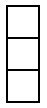
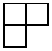
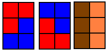
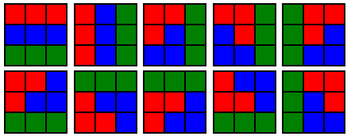

# Tiling

문제 ID: `TILING`

## 문제

#### 문제

You recently moved in a very nice apartment. You are so rich that the whole floor of the building is yours, and you decided to tile the hallway up with two types of blocks:

 

Now, you are asked to calculate how many ways you can tile the 3×n grid using these blocks. For instance, if n = 2, there are total 3 ways:

Of course, you can rotate or flip blocks. Being very nice, I can tell you that there are 10 ways of tiling 3 × 3 grid:

Given n, compute how many ways you can tile the hallway up. Assume you have unlimited supply of each type of blocks.

## 입력

#### 입력

Your program is to read from standard input. The input consists of T test cases. The number of test cases T(1 ≤ T ≤ 30,000) is given in the first line of the input. Each following line will contain one positive integer N, where N can be up to 10^9.

## 출력

#### 출력

Your program is to write to standard output. Prince exactly one line for each test case, containing a single integer that is the number of ways to tile. Since the answer could be very large, you should use modulo 9,901.

## 노트

#### 노트
