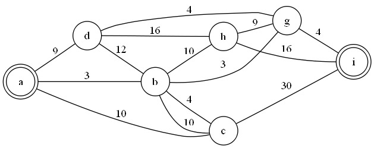

# 여행 경로 정하기

문제 ID: `TPATH`

## 문제

#### 문제

당신은 철도망을 이용해 한 도시에서 다른 도시까지 여행을 하고 싶다. 철도망은 여러 개의 역들과 그들을 잇는 노선으로 구성되어 있다. 각 구간별로 철도의 운행 속도가 정해져 있다.

당신은 멀미를 심하기 하는 편이라, 철도가 가속과 감속을 반복하면 매우 괴롭다. 따라서, 가능한한 여행 중에는 항상 비슷한 속도로 여행하고 싶어한다. 철도망이 주어질 때, 여행 구간 중 최대 운행 속도와 최소 운행 속도의 차를 최소화하는 경로를 찾는 프로그램을 작성하라.

## 입력

#### 입력

입력의 첫 줄에는 테스트 케이스의 수 C (<= 50) 가 주어진다. 각 테스트 케이스의 첫 줄에는 철도역의 수 N (<= 2000) 과 운행 구간의 수 M (<= 4000) 이 주어진다. 각 철도역은 0 부터 N-1 까지의 정수로 주어진다. 그 후 M줄에 각 3개의 정수로 운행 구간의 정보가 주어진다. 구간의 정보는 a b c 로 표현되며, 이때 이 구간은 a번 철도역과 b번 철도역 사이를 운행하며 속도는 c 이다. 모든 구간은 양방향 통행이 가능하다. 속도는 1000 이하의 음이 아닌 정수이다.

시작 철도역은 항상 0번이고, 도착할 철도역은 항상 N-1번이다.

## 출력

#### 출력

각 테스트 케이스마다 속도 차이의 최소값을 출력한다.

## 노트

#### 노트
