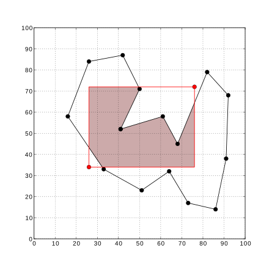

# 보물섬

문제 ID: `TREASURE`

## 문제

#### 문제

위대한 해적 [가이브러시 포피우드](http://en.wikipedia.org/wiki/Guybrush_Threepwood)가 위대한 보물 [투피스](http://ko.wikipedia.org/wiki/%EC%9B%90%ED%94%BC%EC%8A%A4_(%EB%A7%8C%ED%99%94))를 숨겨뒀다는 보물섬을 오랜 고난을 거쳐 찾아냈습니다. 가이브러시는 이 보물섬 어디엔가 투피스를 묻어뒀다고 알려지고 있는데, 그 위치가 어디인지는 모릅니다. 섬을 다 뒤집어 엎기 직전, 지도에는 [여백이 부족해 적지 않았던](http://ko.wikipedia.org/wiki/%ED%8E%98%EB%A5%B4%EB%A7%88%EC%9D%98_%EB%A7%88%EC%A7%80%EB%A7%89_%EC%A0%95%EB%A6%AC) 보물의 위치가 적힌 쪽지를 발견했습니다. 이 쪽지에는 보물이 묻혀 있는 곳이 적혀 있는데, 설명이 길고 장황한 데다 군데 군데 지워져 정확히 알아보기 쉽지 않았습니다. 쪽지를 열심히 연구한 결과, 보물이 묻혀 있는 곳의 범위를 어느 정도 좁힐 수 있었습니다.

섬의 지도가 위 그림과 같이 N개의 점을 갖는 다각형으로 주어질 때, 보물이 묻혀 있을 수 있는 곳은 두 점 (x1,y1)과 (x2,y2) 를 서로 대칭인 꼭지점으로 갖고, 네 변이 모두 x축 혹은 y축에 평행한 직사각형 내부입니다. 우리는 이 직사각형 내에 포함된 육지를 전부 조사하고 싶습니다. 우리가 조사해야 할 부분의 넓이를 계산하는 프로그램을 작성하세요.

## 입력

#### 입력

입력의 첫 줄에는 테스트 케이스의 수 C (C <= 50) 가 주어집니다. 각 테스트 케이스의 첫 줄에는 다섯 개의 정수로 직사각형의 꼭지점의 좌표 x1 , y1 , x2 , y2 (0 <= x1 < x2 <= 100,0 <= y1 < y2 <= 100) 그리고 섬의 지도를 나타내는 다각형 꼭지점의 수 N (3 <= N <= 100) 이 주어집니다. 그 후 N 줄에 각 2개의 정수로 각 꼭지점의 좌표 Xi , Yi (0 <= Xi, Yi <= 100) 가 주어집니다. 꼭지점은 시계 반대 방향으로 주어지며, 마지막 점은 첫 번째 점과 연결되어 있습니다.

주어진 섬의 면적이 0이거나, 섬의 경계선이 자기 자신과 교차하거나 겹치는 경우는 없습니다.

## 출력

#### 출력

각 테스트 케이스마다 한 줄에 조사해야 할 육지의 넓이를 출력합니다. 10-7 이하의 절대/상대 오차를 갖는 답은 정답으로 인정됩니다.

## 노트

#### 노트
