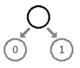
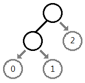
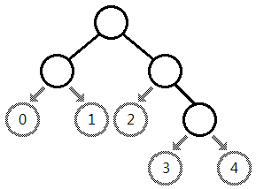

# Tree Code

문제 ID: `TREECODE`

## 문제

#### 문제

Taeyoon, a professional computer programmer, has made a problem related to the binary tree structure in the latest contest. After writing the problem description and the judge solution, he had to make test cases which would be used in the contest. However, making various tree structure was not an easy problem. After long and thoughtful consideration, he finally came up with an idea called the **tree code**.

Consider a simple binary tree with a single (root) node. Then, we can choose one of the two branches in order to add a node.

After adding a child node to the root, now the tree has two nodes. Then again, we can choose one of the three branches to add another node.

Put differently, if we want to add a new node to the current binary tree with K nodes, we should choose one of the K+1 branches. As we can see from the figure below, these K+1 branches can be labeled using numbers between 0 and K, inclusive, according to their appearance in the in-order search performed on the tree (informally, the left-most node will be labeled as 0 as in the figure below).

As we build a binary tree from a single root node, if we record the sequence of the branch numbers to which we add a new node, then the resulted string can describe a binary tree we end up with. This string is called the **tree code** for the binary tree we construct.

A tree code consists of numbers and uppercase alphabets. Branch numbers 0 to 9 are described as '0' to '9', and 10 to 35 as 'A' to 'Z'. One tree code can uniquely describe a binary tree, but a tree can be described by a number of different tree codes. For example, both 02 and 10 describe the binary tree consisting of a root and its two children.

You are given a binary tree and asked to find the lexicographically M-th tree code that describes the given tree.

A tree code A is lexicographically smaller than a tree code B of the same length if the i-th character of A is smaller than the i-th character of B where i is the first position where A and B differ ('0' is smaller than '1'). Character-wise, a numeric digit (0-9) is lexicographically smaller than any alphabet.

## 입력

#### 입력

Your program is to read from standard input. The input consists of T test cases.  
The number of test cases T is given in the first line of the input.  
The first line of each test case contains a tree code describing a binary tree, and an integer M(1 <= M <= 10^18).   
Each tree code will contain at least one character, and its length will not exceed 36. You can assume that all tree codes given in the input data are valid.

## 출력

#### 출력

Your program is to write to standard output. Print exactly one line for each test case.  
The line should contain the lexicographically M-th tree code which can describe the given tree.  
If the number of tree codes that describe the given tree is smaller than M, print 'IMPOSSIBLE'(without quotation marks).

## 노트

#### 노트
