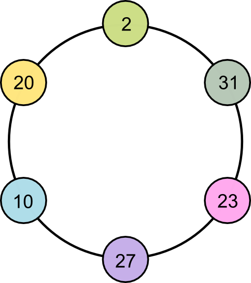

# XOR Necklace

문제 ID: `XORNECKLACE`

## 문제

#### 문제

Frograms, Inc. has been busy developing necklaces with brand-new design and feature. Every programmer working at Frograms now wears this necklace. A necklace consists of multiple beads stringed by a thread, as seen below. Each bead is given a number between 0 to 109 (inclusive).

Most of the programmers have left for their summer vacation, and there is only a few programmers in the office today. So they decided to play a game using their own necklace to decide who will buy lunch for everyone. The rule is simple: for each pair of consecutive beads in the necklace, we take the XOR of their numbers. A programmer's score is defined as the sum of all those XOR values. The programmer with the lowest score loses! More formally, if there are N beads and their value is denoted by A1, A2, ..., AN in the order they are stringed together, then the score is:

(A1 xor A2) + (A2 xor A3) + ... + (AN-1 xor AN) + (AN xor A1)

However, you, the most talented programmer in Frograms, Inc., is going to cheat the game by removing zero or more beads to maximize the score. What is the maximum score if you are allowed to remove some of the beads in a given necklace? Note that you cannot reorder the beads, nor leave one or less beads in a necklace.

## 입력

#### 입력

The input consists of T test cases. The first line of the input contains T.

Each test case starts with a line containing a single integer N (2 <= N <= 500), the number of beads on your necklace. The next line contains N integers A1, A2, ..., AN, separated by a single space.

## 출력

#### 출력

For each test case, print the maximum score possible you can get in a single line.

## 노트

#### 노트

* 출제: wookayin
* 디스크립션: Being
* 데이터 준비: wookayin
* 검수: Being
